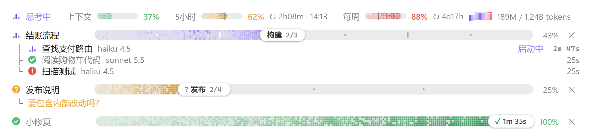
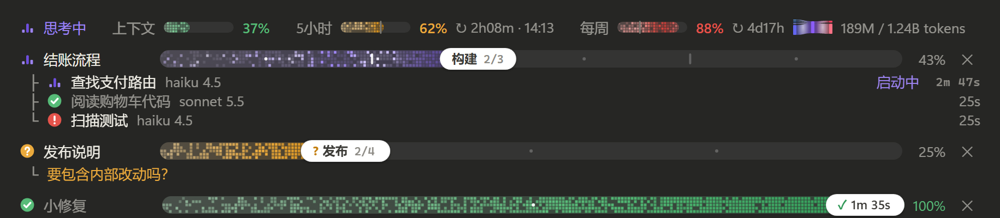

# claude-progress-band

Claude Code 模组：在输入框上方的频段里，实时显示**上下文 / 5 小时 / 每周用量**，以及 Claude 把任务拆成阶段和步骤后的**像素进度条**和它的**子代理**。

[English](#english)




<sub>预览为静态截图；实际使用时管道里的光会流动，像素会闪烁。</sub>

## 功能

**用量**
- 上下文、5 小时、每周三块像素表，按用量变绿 / 橙 / 红。
- 限额表上的竖线标出窗口已经过去多少：用量跑到竖线前面，说明消耗快于恢复。
- 显示重置倒计时，5 小时窗口再显示重置时刻（本地时区）。
- 每周表后合并显示"本会话 / 本周" token（K / M / B），前面是一个小桑基图标；悬停展开完整桑基图：输入 / 输出 / 缓存写 / 缓存读四类汇入本周总量，再分到本会话和其他会话。
- 额度提醒：5 小时额度达到 85% 时，提示 Claude 在当前步骤收尾、说明进度后停下，等你的下一个指令（每个窗口只提醒一次，进行中的进度条转为"需要输入"）。这是收尾提示，不是引擎强制停止。

**当前状态**（和用量表同一排，排在最前）
- "思考中"或正在用的工具名，三根音柱跳动；空闲时显示"空闲"，音柱变灰并缓慢摆动。
- 不重复应用自己已显示的内容：本轮用时看应用的轮次页脚，模型和 effort 看输入框的模型选择器。

**任务进度条**
- 每个任务一行：状态、标题、进度条、百分比、关闭按钮。
- 像素管道：起点稀疏，越靠近白色滑块越密越深。
- 实时：有工作在跑时（Claude 正在处理这个任务，或它的子代理在运行），光会在管道里缓慢流向滑块，子代理越多光越密；工作暂停时光以一半速度继续流动、像素轻轻闪烁，图标音柱缓慢摆动，不会静止。
- 滑块显示当前阶段和步骤，悬停显示已用时间。
- 阶段边界是短竖条，步骤是圆点；悬停显示到达时刻和用时。
- 四种状态：进行中（紫）、需要输入（橙，缓慢呼吸）、出错（红）、完成（绿，滑块显示总用时）。
- 计划可以在执行中改写，已完成的步骤按标题保留。
- 进度条按会话保存，恢复会话时重新显示。

**子代理**
- 每个子代理挂在所属任务下，显示名称、模型和 effort、当前工具、计时。

**适配**
- 文字使用应用自身的字体和颜色，浅色、深色主题都能看清。
- 遵循系统的"减少动态效果"设置。
- 终端里用字符画显示同样的信息。

## 安装

需要 Claude Code **v2.1.286 或更新**（桌面版 Code 标签页或终端均可）。如果在 v2.1.286 上模组没有加载，设置环境变量 `CLAUDE_CODE_ENABLE_FUNCTION_HOOKS=1`（可以写进 `~/.claude/settings.json` 的 `env`）后重启。

仓库名是 `claude-progress-band`，插件名和 marketplace 名均为 `progress-band`。

在 Claude Code 里依次运行：

```text
/plugin marketplace add Chrisutina/claude-progress-band
/plugin install progress-band@progress-band
/reload-plugins
```

不安装、直接从本地目录加载：

```bash
claude --plugin-dir /path/to/claude-progress-band
```

Windows PowerShell 示例：

```powershell
claude --plugin-dir "D:\Plugins\claude-progress-band"
```

桌面版没有命令行参数可用时，把目录的绝对路径写进 `~/.claude/settings.json` 的 `env.CLAUDE_CODE_PLUGIN_DIRS`。

> 模组和 Claude Code 同权限运行、没有沙箱。安装前请先看一遍 `hooks/register.tsx`。

## 工作原理

- 模组注册一个工具 `plan_progress`，并在系统提示词里加一小段规则：需要多于约 3 次编辑或命令的任务，Claude 先建一条进度条，之后用短操作推进，例如 `{id, next:true}`、`{id, done:[...], active:"..."}`、`{id, failed:"...", note}`、`{id, state:"needs_input", note}`。名字不存在的步骤会被拒绝，并返回该进度条的步骤列表。
- 子代理行、模型和 effort、当前工具都来自引擎事件，不额外消耗 token。
- 一轮做了编辑却留着没更新的进度条就结束时，模组会让 Claude 回去更新一次（每轮最多一次）。以问句结尾的回答会把进度条标成"需要输入"。
- 上下文和限额读数来自 Claude Code 自身（和状态栏同一来源）；限额读数在本机各会话之间共享，新会话一打开就有数。
- token：每次模型请求结束时，记到本机的插件存储里，按每周窗口汇总。只统计本机装了此模组的 Claude Code 会话（从安装起），不含其他设备和 claude.ai，所以和每周百分比不是同一口径。
- 数据只存在 Claude Code 的插件存储里；模组不联网，不读写任何文件，不启动进程。

## 已知限制

- mods API 仍是早期版本，Claude Code 升级后可能需要跟着改。
- 只在 Windows 桌面版上实际使用过；终端界面只经过自动测试；macOS、VS Code 和手机端没有实测。
- 终端里没有悬停，时间直接写在进度条后面。

## 开发

克隆仓库后直接运行 Claude Code 自带的验证和测试，不需要 `npm install` 或单独构建：

```bash
git clone https://github.com/Chrisutina/claude-progress-band.git
cd claude-progress-band
claude plugin validate .
claude plugin validate .claude-plugin/plugin.json
claude plugin test .
```

第一条验证 marketplace；第二条验证插件清单、hooks 和状态类型。测试覆盖进度操作、会话恢复、并发保存、用量统计以及桌面 / 终端渲染边界；本次发布在 Windows、Claude Code **2.1.288** 上通过 **26 项测试**。

模组从这个目录加载一次之后，Claude Code 会写出 `.claude-plugin/types/`（已加入 `.gitignore`），`tsconfig.json` 会用到它；也可以在会话里运行 `/plugin-types` 生成类型。

生成类型用于编辑器提示，不随仓库发布；运行上述测试无需先生成它们。仓库中的 `types/index.d.ts` 是插件自身的状态类型，需要保留。

## 致谢

- 任务进度的逻辑（短操作、改写计划、从引擎事件取子代理）和自走时钟改编自 [zycck/claude-mods](https://github.com/zycck/claude-mods) 的 plan-progress（MIT，Kirill Serditov）。
- 用量表的想法来自 [HolyGrail/claude-mods](https://github.com/HolyGrail/claude-mods) 的 usage-meter；这里的代码是重写的。
- 外观参考了 Claude 自带的 effort 滑块。

## 许可证

[MIT](LICENSE)

---

## English

A Claude Code mod. The band above the prompt shows **context, 5-hour and weekly usage** (with the week's tokens), and a **live pixel progress bar** for each task Claude splits into stages and steps, with its **subagents** listed under it.

**Features**
- **Usage meters:** green / amber / red by level, and a tick on each limit marking how much of its window has gone. Reset countdowns, plus the 5-hour reset time in local time.
- **Tokens:** this session's and the week's in one item after the weekly meter ("session / week", in K / M / B), led by a tiny Sankey icon. Hover for the full Sankey: input, output, cache write and cache read flow into the week's total, which splits into this session and the other sessions.
- **Quota reminder:** once the 5-hour window reaches 85%, Claude is prompted to finish the current step at a clean point, say what is done and what is left, and wait for your next instruction. It is said once per window, and the open bar turns to "needs input". This is a prompt, not an engine-enforced stop.
- **Current state:** leads the meters' row: "thinking" or the tool in use, with dancing level bars; "idle" with grey bars swaying slowly. It leaves out what the app already shows: the turn time (the turn footer) and the model and effort (the model picker).
- **Task rows:** state, title, bar, percent, close button.
  - The bar is a pixel pipe that packs denser toward a white thumb.
  - Light flows down the pipe while something works on it: the current turn, or the task's subagents. More running agents means more light. While the work pauses, the light keeps drifting at half speed and the pixels twinkle softly, so the bar never freezes.
  - The thumb shows the stage and step; hover it for the elapsed time. Stage ticks and step dots show their arrival time on hover.
- **Four states:** running, needs input, error, done. A finished bar turns green and shows the total time.
- **Plans** can change mid-run; finished steps are kept by title. Bars are saved per session and come back on resume.
- **Subagent rows:** name, model and effort, current tool, time.
- **Themes and motion:** follows the app's light or dark theme and the OS "reduce motion" setting. The terminal shows a text version.

**Install** (Claude Code v2.1.286 or later; if the mod does not load on v2.1.286, set `CLAUDE_CODE_ENABLE_FUNCTION_HOOKS=1` and restart):

The repository is `claude-progress-band`; the plugin and marketplace are both named `progress-band`.

```text
/plugin marketplace add Chrisutina/claude-progress-band
/plugin install progress-band@progress-band
/reload-plugins
```

**Development** (no separate build or `npm install`):

```bash
git clone https://github.com/Chrisutina/claude-progress-band.git
cd claude-progress-band
claude plugin validate .
claude plugin validate .claude-plugin/plugin.json
claude plugin test .
```

Release verification: **26 tests passed on Windows with Claude Code 2.1.288**. Generated `.claude-plugin/types/` files support editor types and are ignored by Git; the test runner does not require them. The plugin's own `types/index.d.ts` is included.

The desktop UI has been used on Windows. Terminal rendering has automated coverage; macOS, VS Code and mobile have not been tested manually. The mods API is early and may change with Claude Code updates.

**How it works**
- The mod registers a `plan_progress` tool and adds a short rule to the system prompt, so Claude creates a bar for multi-step work and moves it with short ops.
- Subagent rows come from engine events and cost no tokens.
- If a turn edited files and left a bar unexplained, Claude is sent back once to update it.
- Token counts are summed per model request, in local plugin storage, from sessions on this machine that run the mod. Other devices and claude.ai are not counted.
- No network, no file access, no processes.

The task-progress logic and the self-running clock are adapted from [zycck/claude-mods](https://github.com/zycck/claude-mods) plan-progress (MIT). The usage-meter idea comes from [HolyGrail/claude-mods](https://github.com/HolyGrail/claude-mods); its code is not reused.

License: [MIT](LICENSE)
