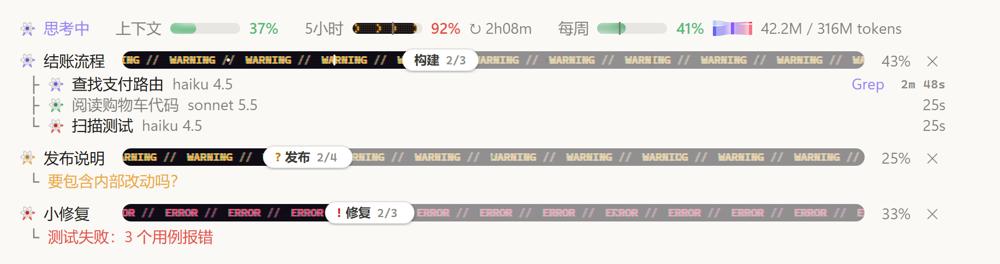

# claude-progress-band

Claude Code 模组：在输入框上方的频段里，实时显示**上下文 / 5 小时 / 每周用量**，以及 Claude 把任务拆成阶段和步骤后的**极光进度条**和它的**子代理**。界面文字可选中文或英文。

版本 **0.5.0** · [更新记录](CHANGELOG.md) · [English](#english)


<sub>中文界面的静态截图，上浅色、下深色：任务进行中（紫色极光，下面挂着子代理）、等你回答（橙色，缓慢呼吸）、出错（故障带）。实际使用时极光在管道里流动，故障带里的字在流、隔一阵撕裂一下，状态图标里的电子绕核转。</sub>

## 功能

**用量**
- 上下文、5 小时、每周三块极光表，按用量变绿 / 橙 / 红。
- 限额表上的竖线标出窗口已经过去多少：用量跑到竖线前面，说明消耗快于恢复。
- 显示重置倒计时，5 小时窗口再显示重置时刻（本地时区）。这一排始终保持一行，窗口窄时依次省略重置时刻、倒计时和 token 文字。
- 每周表后合并显示"本会话 / 本周" token（K / M / B），前面是一个小桑基图标；悬停展开完整桑基图：输入 / 输出 / 缓存写 / 缓存读四类汇入本周总量，再分到本会话和其他会话。
- 额度提醒：5 小时用量达到 90% 时，5 小时表变成琥珀色点阵箭头；之后每多用 2%（90%、92%、94%……），未完成的任务进度条就变成故障带 6 秒（琥珀色 WARNING 带着青红重影流动，有活干时更快），再恢复原样，直到窗口重置；平时一切照旧，也不另外显示文字。只是界面提醒：不通知 Claude，也不打断或暂停当前工作。



**当前状态**（和用量表同一排，排在最前）
- "思考中"或正在用的工具名，原子图标里的三颗电子绕核飞转；空闲时显示"空闲"，原子变灰、电子慢慢转。
- 不重复应用自己已显示的内容：本轮用时看应用的轮次页脚，模型和 effort 看输入框的模型选择器。

**任务进度条**
- 每个任务一行：状态、标题、进度条、百分比、关闭按钮。
- 极光管道：三层柔光在填充部分里流向白色滑块，大团深色光云走得慢，细亮的光丝跑在前面。
- 实时：有工作在跑时（Claude 正在处理这个任务，或它的子代理在运行），极光流向滑块，子代理越多流得越快；工作暂停时以一半速度继续漂，图标里的电子也转慢，不会静止。
- 滑块显示当前阶段和步骤，悬停显示已用时间。
- 阶段边界是短竖条，步骤是圆点；悬停显示到达时刻和用时（以完成状态直接写进计划的步骤只显示"完成"，没有时刻）。
- 四种状态：进行中（紫）、需要输入（橙，缓慢呼吸）、出错（整条变成故障带：ERROR 带着青红重影流动，隔两秒撕裂错位一次）、完成（绿，极光慢慢漂，滑块显示总用时）。
- 计划可以在执行中改写，已完成的步骤按标题保留。
- 进度条按会话保存，恢复会话时重新显示。
- 发下一个问题时，上一个问题已完成的进度条自动清掉；未完成的留着，任何一条都可以点 ✕ 关掉。

**子代理**
- 每个子代理挂在所属任务下，显示名称、模型和 effort、当前工具、计时。

**适配**
- 文字使用应用自身的字体和颜色，浅色、深色主题都能看清。
- 界面文字可选中文（默认）或英文，见[语言](#语言)。
- 遵循系统的"减少动态效果"设置（极光、故障带、点阵表和电子都停下）。
- 终端里用字符画显示同样的信息：出错的进度条写满 ERROR，额度提醒那 6 秒里未完成的写满 WARNING，每秒往左走一格。

## 安装

需要 Claude Code **v2.1.286 或更新**（桌面版 Code 标签页或终端均可）。如果在 v2.1.286 上模组没有加载，设置环境变量 `CLAUDE_CODE_ENABLE_FUNCTION_HOOKS=1`（可以写进 `~/.claude/settings.json` 的 `env`）后重启。

仓库名是 `claude-progress-band`，插件名和 marketplace 名均为 `progress-band`。

在 Claude Code 里依次运行：

```text
/plugin marketplace add Chrisutina/claude-progress-band
/plugin install progress-band@progress-band
/reload-plugins
```

不安装、直接从本地目录加载：

```bash
claude --plugin-dir /path/to/claude-progress-band
```

Windows PowerShell 示例：

```powershell
claude --plugin-dir "D:\Plugins\claude-progress-band"
```

桌面版没有命令行参数可用时，把目录的绝对路径写进 `~/.claude/settings.json` 的 `env.CLAUDE_CODE_PLUGIN_DIRS`。

> 模组和 Claude Code 同权限运行、没有沙箱。安装前请先看一遍 `hooks/register.tsx`。

## 语言

界面文字默认中文，可切换成英文（`en`）。给 Claude 看的规则和工具返回本来就是英文，不受影响。

- 终端：运行 `/config`，把 progress-band 的 **Language** 改成 `en`，模组会自动重载。
- 桌面版没有 `/config`：在 `~/.claude/settings.json` 里加下面这段，然后新开会话或运行 `/reload-plugins`。

```json
{
  "pluginConfigs": {
    "progress-band@progress-band": { "options": { "language": "en" } }
  }
}
```

用 `--plugin-dir` 或 `CLAUDE_CODE_PLUGIN_DIRS` 从本地目录加载时，键名换成 `progress-band`。

## 工作原理

- 模组注册一个工具 `plan_progress`，并在系统提示词里加一小段规则：需要多于约 3 次编辑或命令的任务，Claude 先建一条进度条，之后用短操作推进，例如 `{id, next:true}`、`{id, done:[...], active:"..."}`、`{id, failed:"...", note}`、`{id, state:"needs_input", note}`。名字不存在的步骤会被拒绝，并返回该进度条的步骤列表。
- 子代理行、模型和 effort、当前工具都来自引擎事件，不额外消耗 token。
- 一轮做了编辑却留着没更新的进度条就结束时，模组会让 Claude 回去更新一次（每轮最多一次）。以问句结尾的回答会把进度条标成"需要输入"。
- 上下文和限额读数来自 Claude Code 自身（和状态栏同一来源）；限额读数在本机各会话之间共享，新会话一打开就有数。
- token：每次模型请求结束时，记到本机的插件存储里，按每周窗口汇总。只统计本机装了此模组的 Claude Code 会话（从安装起），不含其他设备和 claude.ai，所以和每周百分比不是同一口径。
- 数据只存在 Claude Code 的插件存储里；模组不联网，不读写任何文件，不启动进程。

## 已知限制

- mods API 仍是早期版本，Claude Code 升级后可能需要跟着改。
- 只在 Windows 桌面版上实际使用过；终端界面和英文界面只经过自动测试和截图检查；macOS、VS Code 和手机端没有实测。
- 终端里没有悬停，时间直接写在进度条后面。
- 5 小时读数随 Claude 的每次回复更新，另外每分钟同步一次本机其他会话的读数；故障带在本会话看到读数跨过新台阶的那一刻出现。新开会话或运行 `/reload-plugins` 时如果已经过了 90%，会先闪一次。

## 开发

克隆仓库后直接运行 Claude Code 自带的验证和测试，不需要 `npm install` 或单独构建：

```bash
git clone https://github.com/Chrisutina/claude-progress-band.git
cd claude-progress-band
claude plugin validate .
claude plugin validate .claude-plugin/plugin.json
claude plugin test .
```

第一条验证 marketplace；第二条验证插件清单、hooks 和状态类型。测试覆盖进度操作、会话恢复、并发保存、用量统计、额度提醒、英文界面以及桌面 / 终端渲染边界；本次发布在 Windows、Claude Code **2.1.288** 上通过 **31 项测试**。

模组从这个目录加载一次之后，Claude Code 会写出 `.claude-plugin/types/`（已加入 `.gitignore`），`tsconfig.json` 会用到它；也可以在会话里运行 `/plugin-types` 生成类型。

生成类型用于编辑器提示，不随仓库发布；运行上述测试无需先生成它们。仓库中的 `types/index.d.ts` 是插件自身的状态类型，需要保留。

## 致谢

- 任务进度的逻辑（短操作、改写计划、从引擎事件取子代理）和自走时钟改编自 [zycck/claude-mods](https://github.com/zycck/claude-mods) 的 plan-progress（MIT，Kirill Serditov）。
- 用量表的想法来自 [HolyGrail/claude-mods](https://github.com/HolyGrail/claude-mods) 的 usage-meter；这里的代码是重写的。
- 外观参考了 Claude 自带的 effort 滑块。

## 许可证

[MIT](LICENSE)

---

## English

A Claude Code mod. The band above the prompt shows **context, 5-hour and weekly usage** (with the week's tokens), and a **live aurora progress bar** for each task Claude splits into stages and steps, with its **subagents** listed under it. The band speaks Chinese (default) or English: set `language` to `en`, see [Language](#language) below.

<sub>The screenshots above show the Chinese UI, frozen, light theme then dark: a task running (violet aurora, its subagents under it), one waiting for your answer (amber, breathing) and one that failed (a glitch band). In use, aurora light flows down the pipes, the glitch band's words stream and tear now and then, and electrons circle in the state icons.</sub>

**Features**
- **Usage meters:** green / amber / red by level, and a tick on each limit marking how much of its window has gone. Reset countdowns, plus the 5-hour reset time in local time. The row stays on one line; a narrow window drops the reset time, then the countdowns, then the token words.
- **Tokens:** this session's and the week's in one item after the weekly meter ("session / week", in K / M / B), led by a tiny Sankey icon. Hover for the full Sankey: input, output, cache write and cache read flow into the week's total, which splits into this session and the other sessions.
- **Quota alert:** once the 5-hour window reaches 90%, the 5-hour meter marches amber dot arrows, and each time it climbs 2 more points (90%, 92%, 94%…) every unfinished task bar turns into a glitch band for six seconds, an amber WARNING streaming in cyan and magenta fringes (faster while work runs), then back to normal, until the window resets; otherwise nothing changes, and no words are added. It is a visual alert only: Claude is not told, and nothing stops or pauses the work.

  

- **Current state:** leads the meters' row: "Thinking" or the tool in use, with an atom whose electrons race round; "Idle" with a grey atom spinning slowly. It leaves out what the app already shows: the turn time (the turn footer) and the model and effort (the model picker).
- **Task rows:** state, title, bar, percent, close button.
  - The bar is a pipe of aurora: three layers of soft light drift toward a white thumb, big deep clouds slowly, thin bright wisps racing ahead.
  - The aurora streams while something works on it: the current turn, or the task's subagents. More running agents means faster light. While the work pauses it keeps drifting at half speed and the icon's electrons slow down, so the bar never freezes.
  - The thumb shows the stage and step; hover it for the elapsed time. Stage ticks and step dots show their arrival time on hover (a step sent in already finished shows "done" without a time).
- **Four states:** running, needs input (breathes), error (the bar becomes a glitch band: ERROR streaming in cyan and magenta fringes, tearing every couple of seconds), done (green, drifting slowly, with the total time).
- **Plans** can change mid-run; finished steps are kept by title. Bars are saved per session and come back on resume.
- **Cleanup:** your next prompt clears the bars the previous one finished; unfinished bars stay, and ✕ closes any bar.
- **Subagent rows:** name, model and effort, current tool, time.
- **Themes and motion:** follows the app's light or dark theme and the OS "reduce motion" setting (the aurora, the glitch bands, the dot-matrix meter and the electrons then stand still). The terminal shows a text version: a failed bar reads ERROR, and during an alert's six seconds an open bar reads WARNING, both stepping a cell a second.

**Install** (Claude Code v2.1.286 or later; if the mod does not load on v2.1.286, set `CLAUDE_CODE_ENABLE_FUNCTION_HOOKS=1` and restart):

The repository is `claude-progress-band`; the plugin and marketplace are both named `progress-band`.

```text
/plugin marketplace add Chrisutina/claude-progress-band
/plugin install progress-band@progress-band
/reload-plugins
```

To load it from a local folder instead, run `claude --plugin-dir /path/to/claude-progress-band`, or, in the desktop app, put the folder's absolute path in `env.CLAUDE_CODE_PLUGIN_DIRS` of `~/.claude/settings.json`.

### Language

The band's words are Chinese by default. What Claude reads (the rules, tool results) is English either way.

- Terminal: run `/config` and set progress-band's **Language** to `en`; the mod reloads by itself.
- Desktop app (no `/config`): add this to `~/.claude/settings.json`, then start a new session or run `/reload-plugins`.

```json
{
  "pluginConfigs": {
    "progress-band@progress-band": { "options": { "language": "en" } }
  }
}
```

When the mod loads from a local folder (`--plugin-dir` or `CLAUDE_CODE_PLUGIN_DIRS`), the key is `progress-band`.

**Development** (no separate build or `npm install`):

```bash
git clone https://github.com/Chrisutina/claude-progress-band.git
cd claude-progress-band
claude plugin validate .
claude plugin validate .claude-plugin/plugin.json
claude plugin test .
```

Release verification: **31 tests passed on Windows with Claude Code 2.1.288**, the quota alert, the error band and the English UI included. Generated `.claude-plugin/types/` files support editor types and are ignored by Git; the test runner does not require them. The plugin's own `types/index.d.ts` is included.

The desktop UI has been used on Windows. Terminal rendering and the English UI have automated tests and screenshot checks; macOS, VS Code and mobile have not been tested manually. The mods API is early and may change with Claude Code updates. The 5-hour reading updates with each of Claude's replies and, once a minute, from this machine's other sessions; a glitch shows the moment this session sees the reading cross a new step. A new session, or `/reload-plugins`, that starts past 90% flashes once.

**How it works**
- The mod registers a `plan_progress` tool and adds a short rule to the system prompt, so Claude creates a bar for multi-step work and moves it with short ops.
- Subagent rows come from engine events and cost no tokens.
- If a turn edited files and left a bar unexplained, Claude is sent back once to update it.
- Token counts are summed per model request, in local plugin storage, from sessions on this machine that run the mod. Other devices and claude.ai are not counted.
- No network, no file access, no processes.

The task-progress logic and the self-running clock are adapted from [zycck/claude-mods](https://github.com/zycck/claude-mods) plan-progress (MIT). The usage-meter idea comes from [HolyGrail/claude-mods](https://github.com/HolyGrail/claude-mods); its code is not reused.

License: [MIT](LICENSE)
